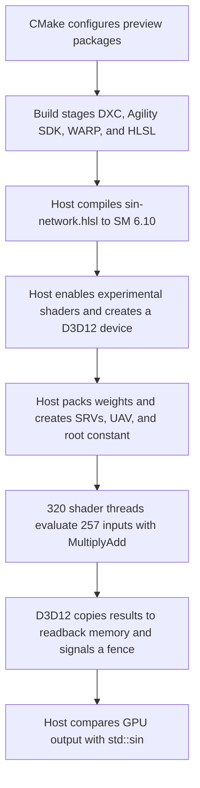

# Sine-network D3D12 sample

The sine-network sample uses a small neural network to approximate `sin(x)` for
257 values on `[-pi, pi]`. The C++ host prepares the network data, compiles and
dispatches a compute shader, and compares the GPU results with `std::sin`. The
HLSL shader uses the Shader Model 6.10 linear-algebra API for its hidden-layer
matrix-vector multiplication.

This tutorial is for readers who know C++ and basic HLSL but are new to D3D12
compute setup or the HLSL linear-algebra API. After completing it, you should be
able to trace every resource from its C++ allocation to its HLSL use and explain
the complete execution flow.

## Contents

- [Build and run](#build-and-run)
- [Train replacement parameters](#train-replacement-parameters)
- [Network and resource layout](#1-start-with-the-network-equation)
- [Preview runtime and shader compilation](#3-select-the-preview-d3d12-runtime)
- [Device setup and dispatch](#5-create-a-device-that-can-run-the-shader)
- [Result validation](#10-validate-the-approximation)
- [Troubleshooting](#troubleshooting)

## Tested dependency versions

The sample uses preview Shader Model 6.10 linear-algebra APIs. Use this matching
toolchain; older retail packages may compile the host but cannot compile or
execute the shader.

| Dependency | Tested version | CMake setting |
| --- | --- | --- |
| Microsoft.Direct3D.DXC | `1.10.2605.37-preview` (DLL `1.10.0.5373`) | `DXC_VERSION` |
| Microsoft.Direct3D.D3D12 | `1.721.3-preview` (preview SDK version 721) | `AGILITY_SDK_VERSION` |
| Microsoft.Direct3D.WARP | `1.65535.20-preview` | `WARP_VERSION` |

CMake uses [`nuget.exe`](https://learn.microsoft.com/nuget/reference/nuget-exe-cli-reference)
to install these packages from the internal
[`packagefeedproxy.microsoft.io`](https://packagefeedproxy.microsoft.io/nuget/v3/index.json)
feed during the first configure. If `nuget.exe` is not on `PATH`, CMake
downloads it into the build directory. Set `NUGET_SOURCE` to select another
NuGet V3 source.

## Prerequisites

You need:

- Windows with Developer Mode enabled and preview Agility SDK support
- Access to `packagefeedproxy.microsoft.io`
- Visual Studio 2019 or newer with the C++ desktop and UWP workloads
- Windows SDK 10.0.26100.0 or newer and its matching Windows Driver Kit
- CMake 3.24 or newer and Ninja
- An x64 or ARM64 build environment

Training replacement parameters also requires Python 3.9 or newer and NumPy.

The main source files are:

- [`sin-network.cpp`](sin-network.cpp): creates the D3D12 device and resources,
  dispatches the shader, and checks the result
- [`sin-network.hlsl`](sin-network.hlsl): evaluates one network input per shader
  thread
- [`train.py`](train.py): fits replacement network parameters and prints C++
  initializers
- [`requirements.txt`](requirements.txt): declares the training dependency
- [`CMakeLists.txt`](CMakeLists.txt): downloads the preview packages, builds the
  host, and stages runtime files

## Build and run

Start from the repository root in a PowerShell development environment. Use an
empty sample-specific build directory to avoid cached package selections:

```powershell
Remove-Item -Recurse -Force build/sin-network -ErrorAction Ignore
cmake -S sin-network -B build/sin-network -G Ninja `
  '-DCMAKE_BUILD_TYPE=Release' `
  '-DDXC_VERSION=1.10.2605.37-preview' `
  '-DAGILITY_SDK_VERSION=1.721.3-preview' `
  '-DWARP_VERSION=1.65535.20-preview' `
  '-DLINALG_USE_PREVIEW_HEADERS=ON'
cmake --build build/sin-network
./build/sin-network/sin-network.exe ./build/sin-network/sin-network.hlsl
```

The post-build command stages the shader, `dx/linalg.h`, DXC DLLs, Agility SDK
DLLs, and WARP DLLs beside the executable. A successful run reports
approximately `0.00271` maximum error and `0.00120` RMS error.

## Train replacement parameters

The checked-in parameters were added with the original sample, without its
training program. `train.py` provides a deterministic way to train a compatible
replacement set; it does not reproduce the original output weights exactly.

The network is linear in its output weights once the 16 hidden slopes are
fixed. The script therefore:

1. Generates 16 geometrically spaced slopes from `0.25` through `3.0`.
2. Rounds the slopes, inputs, and hidden products to FP16 to model the shader's
  hidden-layer arithmetic.
3. Evaluates the 16 `tanh` features over evenly spaced training inputs.
4. Solves a ridge-regression system for the FP32 output weights.
5. Validates the fit on the same 257-point grid used by the C++ sample.
6. Prints `kSlopes` and `kOutputWeights` declarations ready for C++.

The output bias remains zero because `sin`, `tanh`, and the fixed hidden
features are odd functions on the symmetric training interval.

Create an isolated environment and install the dependency from the repository
root:

```powershell
py -3 -m venv .venv
./.venv/Scripts/python.exe -m pip install -r sin-network/requirements.txt
```

Run the trainer with its reproducible defaults:

```powershell
./.venv/Scripts/python.exe sin-network/train.py
```

The default fit uses 16,385 training points and an L2 regularization strength
of `1e-5`. It reports approximately `0.00217` maximum error and `0.000784` RMS
error under the script's shader-like FP16 model. GPU results can differ slightly
because the script approximates the shader's arithmetic rather than executing
the HLSL operation.

To use the generated parameters:

1. Replace the `kSlopes` and `kOutputWeights` declarations in
  [`sin-network.cpp`](sin-network.cpp) with the declarations printed by the
  script.
2. Rebuild and run the native sample with the commands in [Build and
  run](#build-and-run).
3. Check the native maximum and RMS errors. The native run is the authoritative
  validation because it executes the deployed HLSL path.

Use `--help` to list tuning options:

```powershell
./.venv/Scripts/python.exe sin-network/train.py --help
```

Increasing `--training-samples` makes the fit cover the interval more densely.
Increasing `--ridge` reduces coefficient magnitude but may increase error. Keep
the hidden count at 16 unless you also update the matrix dimensions, buffer
layout, loops, and constants in both C++ and HLSL.

## 1. Start with the network equation

For each input $x$, the sample evaluates:

$$
y(x) = c + \sum_{i=0}^{15} w_i \tanh(s_i x + b_i)
$$

The source stores:

- 16 slopes $s_i$ in `kSlopes`
- 16 output weights $w_i$ in the first 16 entries of `kOutputWeights`
- the output constant $c$ in entry 16 of `kOutputWeights`
- zero for every hidden bias $b_i$

The constants are pre-trained parameters. The sample performs inference only;
it does not train the network.

The hidden layer is represented as a $16 \times 4$ matrix because the
linear-algebra operation consumes a four-component feature vector. For this
network, each matrix row and the feature vector are:

$$
A_i = [s_i, 0, 0, 0], \qquad v = [x, 0, 0, 1]
$$

Therefore, `MultiplyAdd(weights, features, bias)` computes the 16 values
$s_i x + b_i$ in one thread-scope matrix-vector operation. The extra components
make the layout suitable for the API but do not change the result.

## 2. Understand the shared CPU/GPU resource contract

The root signature and shader registers must agree. This sample uses four
resource descriptors and one root constant:

| C++ resource | HLSL declaration | Register | View |
| --- | --- | --- | --- |
| `hiddenBuffer` | `HiddenWeights` | `t0` | Raw SRV |
| `inputBuffer` | `Inputs` | `t1` | Structured SRV of `float` |
| `outputWeightBuffer` | `OutputWeights` | `t2` | Structured SRV of `float` |
| `outputBuffer` | `Outputs` | `u0` | Structured UAV of `float` |
| `kSampleCount` | `InputCount` | `b0` | One 32-bit root constant |

An SRV is a shader resource view for read-only data. A UAV is an unordered
access view that permits shader writes.

### Hidden-buffer byte layout

`kHiddenBufferSize` is 288 bytes:

| Byte range | Size | Contents |
| --- | ---: | --- |
| `0..255` | 256 bytes | 16 matrix rows with a 16-byte row stride |
| `256..287` | 32 bytes | 16 contiguous FP16 bias values |

Each matrix row occupies 16 bytes. Its first 8 bytes contain four FP16 matrix
components, and its remaining 8 bytes are padding. In C++, each row therefore
spans eight `uint16_t` values. `hidden[row * 8]` receives the slope, and
`hidden[row * 8 + 3]` explicitly receives zero. The vector was zero-initialized,
so all other matrix components and all bias values are also zero.

The shader mirrors this layout exactly:

```hlsl
HiddenMatrix weights = HiddenMatrix::Load<MatrixLayoutEnum::RowMajor>(
    HiddenWeights, 0, 16);
vector<half, 16> bias = HiddenWeights.Load<vector<half, 16> >(256);
```

The arguments `0` and `16` specify the matrix's starting byte offset and row
stride. The bias load starts immediately after the 256-byte matrix region.
Changing this layout requires matching changes in both source files.

## 3. Select the preview D3D12 runtime

At the top of `sin-network.cpp`, the application exports:

```cpp
__declspec(dllexport) extern const UINT D3D12SDKVersion =
  D3D12_PREVIEW_SDK_VERSION;
__declspec(dllexport) extern const char *D3D12SDKPath = ".\\D3D12\\";
```

The D3D12 loader reads these symbols to select the preview Agility SDK and find
its DLLs relative to the executable. `CMakeLists.txt` creates that `D3D12`
directory and copies the required Agility SDK and WARP files into it.

`LINALG_USE_PREVIEW_HEADERS` controls only the explicit capability queries in
`ReportLinearAlgebraSupport`. It does not remove the shader's dependency on
Shader Model 6.10 linear algebra.

## 4. Compile the compute shader at run time

`CompileShader` creates `IDxcUtils` and `IDxcCompiler3`, then loads the HLSL file
passed to the executable. It invokes DXC with these effective options:

```text
-E main -T cs_6_10 -enable-16bit-types -I <executable-directory>
```

These options select the `main` entry point, target Shader Model 6.10 compute,
enable native 16-bit types, and let `#include <dx/linalg.h>` resolve against the
header copied beside the executable. The default DXC include handler processes
the include.

DXC can return diagnostics even when compilation succeeds, so the function
prints `DXC_OUT_ERRORS` before checking the compilation status. It returns the
compiled shader object as an `IDxcBlob`.

## 5. Create a device that can run the shader

`CreateDevice` performs these operations in order:

1. Calls `D3D12EnableExperimentalFeatures` for experimental shader models.
2. Enables the D3D12 debug layer when it is installed.
3. Enumerates hardware adapters in high-performance preference order.
4. Selects the first non-software adapter that can create a feature-level 12.0
   device.
5. Falls back to WARP when no hardware adapter succeeds.

WARP is Microsoft's software D3D12 adapter. The build stages the selected
preview WARP DLL so the fallback uses a runtime compatible with the shader.

When preview headers are enabled, `ReportLinearAlgebraSupport` first checks for
linear-algebra tier 1. It then asks whether thread vector-matrix multiplication
supports FP16 vector, matrix, bias, and result data. The sample stops with an
error if either query reports insufficient support.

## 6. Prepare the network and input data

`wmain` first compiles the shader and creates the device. It then constructs
three CPU vectors:

1. `hidden` holds the packed FP16 matrix and bias. `FloatToHalf` converts each
   `float` slope to its IEEE 754 binary16 bit representation.
2. `inputs` holds 257 evenly spaced `float` values from `-pi` through `pi`,
   including both endpoints.
3. `outputWeights` copies the 17 pre-trained output constants.

The host creates upload-heap buffers for these vectors. Upload heaps remain
CPU-accessible and enter `D3D12_RESOURCE_STATE_GENERIC_READ`, so the shader can
read them without a separate upload copy in this compact sample.

It also creates:

- a default-heap output buffer with `ALLOW_UNORDERED_ACCESS`, initially in
  `COMMON`
- a readback-heap buffer in `COPY_DEST`, used to return results to the CPU

`CreateBuffer` fills the common `D3D12_RESOURCE_DESC` fields for a row-major
buffer. `CreateUploadBuffer` maps an upload resource, copies the vector bytes,
and unmaps it.

## 7. Create descriptors and the root signature

The shader-visible descriptor heap contains four contiguous descriptors in
register order: three SRVs followed by one UAV.

The hidden data uses a raw SRV because the shader accesses both a strided matrix
and a packed vector from one byte-address buffer. Its `R32_TYPELESS` view exposes
288 bytes as 72 four-byte elements. The other views use four-byte structure
strides because they contain `float` values.

`CreateRootSignature` defines two root parameters:

1. A descriptor table containing `t0` through `t2` and `u0`.
2. One 32-bit constant mapped to `b0`.

The UAV descriptor range has an offset of three descriptors, so it follows the
three SRVs in the same table. The compute pipeline state then combines this
root signature with the compiled shader bytecode.

## 8. Follow one shader invocation

The shader declares a thread-scope matrix type:

```hlsl
using HiddenMatrix =
    Matrix<ComponentType::F16, 16, 4, MatrixUse::A, MatrixScope::Thread>;
```

This is a 16-row, 4-column FP16 matrix used as the left operand (`A`).
`MatrixScope::Thread` means each shader invocation owns and operates on its
matrix value.

The dispatch uses 64 threads per group. Each invocation receives a global
`SV_DispatchThreadID` and follows these steps:

1. Return when `index >= InputCount`. This bounds check handles the partially
   used final thread group.
2. Load `Inputs[index]` and convert it into the FP16 feature vector
   `[x, 0, 0, 1]`.
3. Load the FP16 hidden matrix from byte offset 0 with a 16-byte row stride.
4. Load the 16 FP16 biases from byte offset 256.
5. Call `MultiplyAdd<half>` to compute all 16 hidden pre-activation values.
6. Convert each hidden value to `float`, apply `tanh`, multiply by its output
   weight, and accumulate it with the output constant.
7. Write the final `float` to `Outputs[index]`.

The hidden calculation uses FP16 inputs and results. The output accumulation
uses FP32 because `result` and `OutputWeights` are `float`.

## 9. Record and submit the D3D12 work

Before dispatch, the command list transitions the output buffer from `COMMON`
to `UNORDERED_ACCESS`. It then binds:

- the shader-visible descriptor heap
- the compute root signature
- the descriptor table at root parameter 0
- `kSampleCount` at root parameter 1

The dispatch group count is:

$$
\left\lceil \frac{257}{64} \right\rceil = 5
$$

Five groups launch 320 threads. The shader's bounds check discards indices 257
through 319.

After dispatch, the command list transitions the output from
`UNORDERED_ACCESS` to `COPY_SOURCE` and copies it into the readback buffer. The
host closes the list, submits it to a direct command queue, and signals a fence.
`WaitForGpu` waits on a Windows event until fence value 1 completes. This wait
must finish before the CPU maps the readback resource.

## 10. Validate the approximation

The host maps exactly the readable byte range and compares each GPU result with
`std::sin(inputs[i])`. It computes:

$$
\text{max error} = \max_i |y_i - \sin(x_i)|
$$

and

$$
\text{RMS error} =
\sqrt{\frac{1}{257}\sum_{i=0}^{256}(y_i - \sin(x_i))^2}
$$

A successful run reports the sample count, maximum absolute error, and root
mean square (RMS) error. With the tested package versions, the expected values
are approximately `0.00271` maximum error and `0.00120` RMS error.

## Troubleshooting

### Shader compilation fails

Confirm that the executable directory contains `dx/linalg.h`, `dxcompiler.dll`,
and `dxil.dll`. Also confirm that CMake selected the preview DXC version from
the prerequisites. The retail compiler does not support this Shader Model 6.10
linear-algebra sample.

### Agility SDK loading fails

Confirm that `build/sin-network/D3D12/D3D12Core.dll` exists and matches the
`D3D12SDKVersion` compiled into the executable. Reconfigure from an empty build
directory after changing `AGILITY_SDK_VERSION`.

### The capability query or pipeline creation fails

The adapter or loaded runtime may not support the requested preview operation.
Build with `LINALG_USE_PREVIEW_HEADERS=ON` to get the explicit tier and FP16
operation checks. Confirm that the staged WARP DLL and Agility SDK are the
preview versions listed in the prerequisites.

### Results are incorrect after changing the network

Check the contracts that cross the C++/HLSL boundary:

- matrix dimensions and the hidden-neuron count
- FP16 versus FP32 element types
- the 16-byte matrix row stride
- the 256-byte bias offset
- descriptor order and shader registers
- dispatch size and `InputCount`

A change to any of these values usually requires a matching change in both
`sin-network.cpp` and `sin-network.hlsl`.

## Execution summary



See [`sin-network.cpp`](sin-network.cpp) for host setup and validation,
[`sin-network.hlsl`](sin-network.hlsl) for per-input inference, and
[`CMakeLists.txt`](CMakeLists.txt) for package installation and runtime staging.
